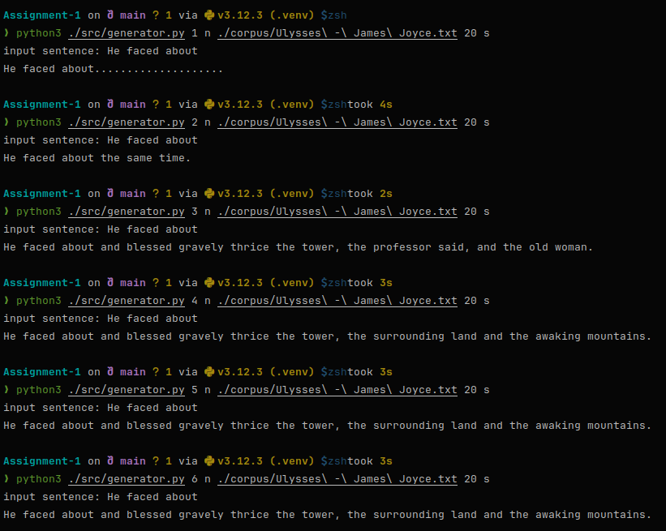
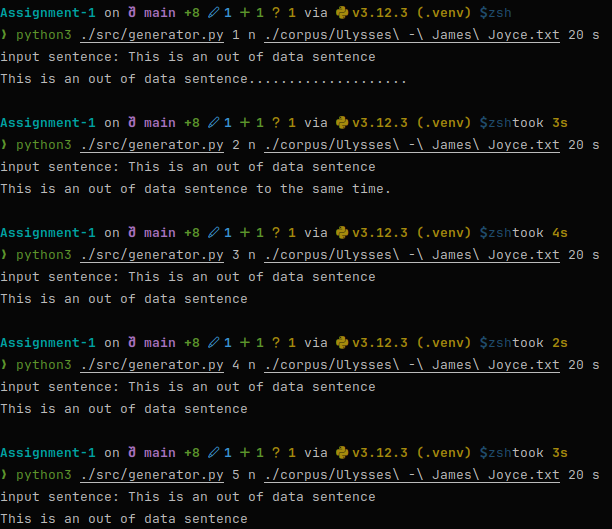
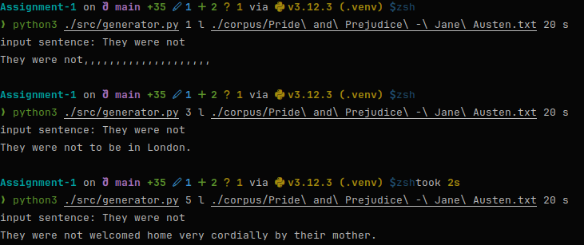
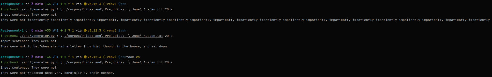
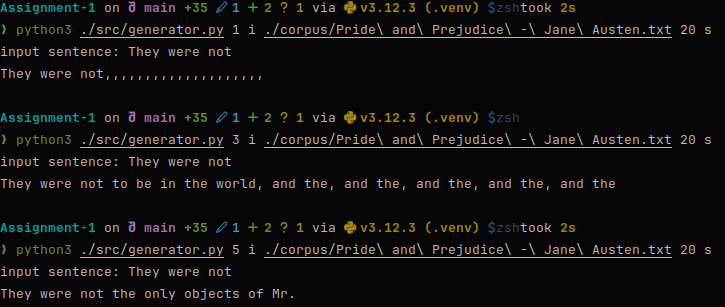
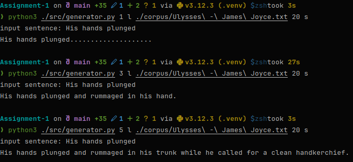
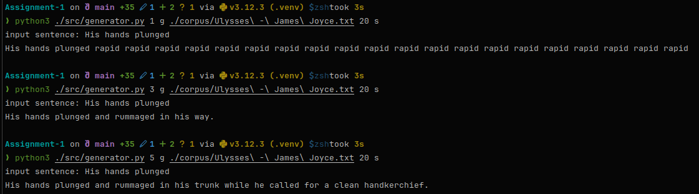
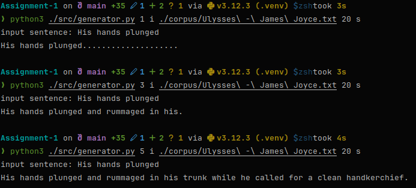

## Name: Kritin Maddireddy

## Roll Number: 2022101071

---

---

# Average Corpus Perplexity Scores - Analysis

### LM1

LM1 for N = 1 -> train = 414, test = 416  
LM1 for N = 3 -> train = 1781, test = 3033  
LM1 for N = 5 -> train = 2475, test = 4710

### LM2

LM2 for N = 1 -> train = 598, test = 689  
LM2 for N = 3 -> train = 20, test = 70  
LM2 for N = 5 -> train = 13, test = 50

### LM3

LM3 for N = 1 -> train = 413, test = 459  
LM3 for N = 3 -> train = 11, test = 186  
LM3 for N = 5 -> train = 7, test = 189

### LM4

LM4 for N = 1 -> train = 821, test = 1059  
LM4 for N = 3 -> train = 8963, test = 15575  
LM4 for N = 5 -> train = 11536, test = 21430

### LM5

LM5 for N = 1 -> train = 2200, test = 3676  
LM5 for N = 3 -> train = 129, test = 235  
LM5 for N = 5 -> train = 176, test = 298

### LM6

LM6 for N = 1 -> train = 832, test = 1299  
LM6 for N = 3 -> train = 16, test = 955  
LM6 for N = 5 -> train = 12, test = 962

## Observations

1. Clearly, `Laplacian Smoothing` (LM1 and LM4) is the worst of the bunch on either corpus. However, interestingly, as
   `N`
   increases, the perplexity also increases. This might be due to its nature of uniformly distributing probabilities (
   the vocabulary size in the denominator is too large). **This is thus the worst smoothing method for both the given
   corpora.**
2. `Good-Turing Smoothing` (LM2 and LM5) have decent training and testing perplexity values. The difference between them
   isn't
   as high as it is for linear interpolation, suggesting that it doesn't overfit to the training corpus. As `N`
   increases, perplexity decreases (as we would expect). Thus, it performs well, and manages unseen data effectively,
   and generalizes better. **This is thus the best smoothing method for both the given corpora.**
3. `Linear Interpolation` (LM3 and LM6) has a much larger difference between the training and testing perplexity values,
   suggesting that it is tending to be overfit to the training data. This is particularly noticeable when `N = 5`, as
   clearly, the test perplexity increases when compared to `N = 3` but the training perplexity decreases. However, it is
   important to note that a better way of obtaining the `λ` weights of each model might result in better perplexity
   scores.
4. In general, for `N = 1`, the perplexity scores seem pretty random as all methods are bad at trying to obtain
   the probability without any context.

---

---

# Generation - Analysis

## Task-1

## Using the generated N-gram models (without the smoothing techniques), try generating sequences. Experiment with different values of N and report which models perform better in terms of fluency.

### Observations

* As `n` increases, the fluency increases as well.
* However, as we keep greedily selecting the most probable word at each step, it is quite likely that we will end up
  with repetitive sentences.
* The above phenomenon is particularly noticeable in smaller values of `n`, as the model saturates early since it cannot
  predict the next word anymore, or it runs into an infinite loop.
* In fact, for `n = 1`, we get stuck in an infinite loop of `.`s are this is by far the most common token found in the
  corpus. However, it cannot predict the next token to be `</s>` as it has a context length of 0, and thus never
  terminates.
* Upon increasing `n` value of `n`-gram, the model starts generating sentences that make more and more sense.

---

## Task-2

## Attempt to generate a sentence using an Out-of-Data (OOD) scenario with your N-gram models. Analyze and discuss the behavior of N-gram models in OOD contexts.

### Observations

* Smaller `n` valued models perform better than larger `n` valued models in this case.
* This is because, for smaller models, the latest context is more likely to be present in the training corpus and thus,
  it generates whatever it can find.
* However, as `n` value increases, the specificity of the context increases and the likelihood of it existing in the
  corpus falls rapidly.
* As `n`-gram models are dumb -- they cannot generate something that they haven't seen before, due to the lack of
  sufficient training data (there can never be enough), OOD contexts are particularly bad for `n`-gram models.
* A better way to generate text in general is to try and teach the model the _vocabulary and semantics_ of a language,
  but `n`-gram models cannot do this as they do not "learn".

---

## Task-3

## Now try to generate text using the models with the smoothing techniques (LM1, LM2, LM3, LM4, LM5, LM6) for N=1,3 and 5 each.

#### LM1

#### LM2

#### LM3

#### LM4

#### LM5

#### LM6

### Observations

* For `n = 1`, regardless of smoothing, all the language models run into a loop. This is because, no context is present
  to make a decision, and thus, the token with the highest probability is picked every single time.
* As this is never the end token, so it simply loops.
* However, interestingly enough, `Good-Turing Smoothing` seems to pick a word and not a punctuation unlike the other two
  smoothing methods.
* For all the models however, as `n` increases, their fluency also increases.
* At `n = 5`, all of them seem to converge to producing the same sentence. However, this might just be a virtue of the
  fact that the training data is not exhaustive, and the sentence I picked for longer contexts might lead to the context
  being present only once in the corpus.
* Of the three types of smoothing methods, `Good-Turing Smoothing` produces the most fluent sentences.
* `Laplacian Smoothing` however, doesn't really produce good sentences. This is probably because us adding `1` might be
  too much, or the size of the vocabulary in the denominator might be too large making all the probabilities small.
* `Linear Interpolation` might actually be better than `Good-Turing Smoothing` at producing sentences if we figure out a
  better way of setting the `λ` weights of each model. Perhaps, we could use something like the _EM (
  Expectation-Maximization) algorithm_.
* However, the above takes too long to train the model.

---
